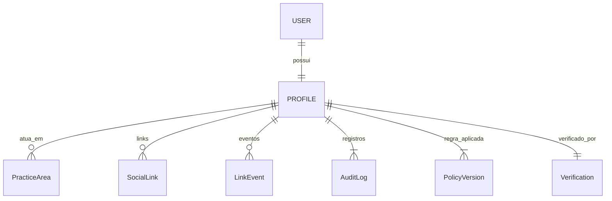
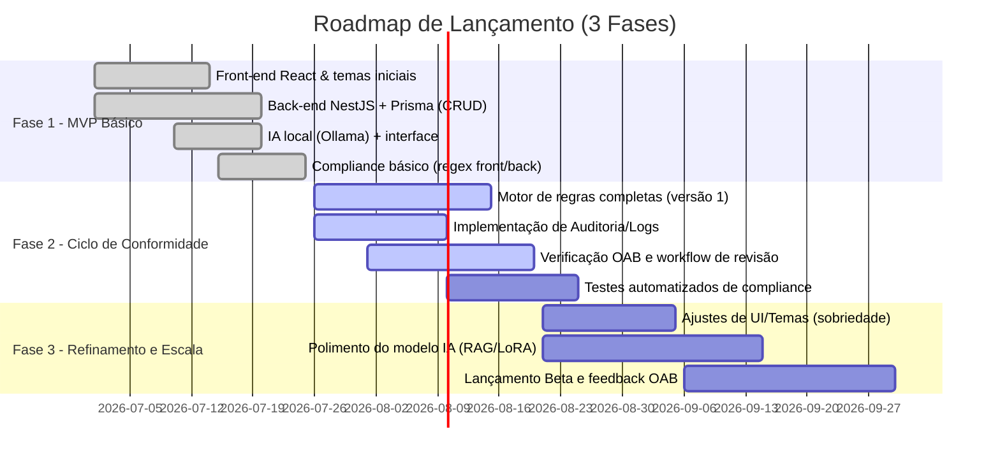

# Resumo Executivo  
A proposta **advoc.me** é inovadora, mas o verdadeiro diferencial está na garantia de **conformidade ética e disciplinar** com as regras da OAB. Todo conteúdo – texto, imagens, elementos de UI – deve seguir estritamente o Provimento 205/2021 (CFOAB), o Código de Ética/Disciplina (Res. 02/2015) e demais normativos. Em suma: **nada de linguagem mercadológica, promessas de sucesso ou apelo comercial**. Cada perfil deve ser *informativo* e *sóbrio*, sem captação de clientela disfarçada. Caso contrário, o produto se torna apenas mais um “Linktree” e expõe o advogado a sanções disciplinares (advertência, censura, suspensão).  

Nas recomendações técnicas abaixo, listamos **itens absolutamente vedados** (com fontes legais e exemplos proibidos), e sugerimos **mudanças no código** para reforçar o compliance: reforço de regex de bloqueio, trilha de auditoria, engine de políticas versionadas, validação humana pós-Geração IA etc. Também apresentamos um prompt detalhado para guiar o gerador de bios conforme as regras da OAB, incluindo verificações pós-Geração. Diagramas Mermaid ilustram o workflow de compliance, o modelo de dados estendido (com auditoria e verificação) e um cronograma de 3 fases para o lançamento. Em todos os pontos, priorizamos fontes oficiais (Provimento/CFOAB, Cartilhas OAB, Código de Ética) e segurança jurídica, marcando qualquer área ambígua como “não especificado”.

## Itens Proibidos (perfis, bios, UI e conteúdos)  

Abaixo listamos **categorias e exemplos** de itens que **NÃO podem aparecer** no produto. Cada item é proibido por norma específica da OAB (Provimento 205/2021, Código de Ética e cartilhas do Comitê de Marketing). A violação acarreta risco de **sanção disciplinar** (por infração ao Provimento/Código) e possível ação civil (ex: responsabilidade por publicidade enganosa), além de dano reputacional. *Em caso de dúvidas sobre termos não citados, assume-se “não especificado” – priorizar sempre o caráter informativo e discreto*.  

### 1. Conteúdo de Texto e Frases Proibidas  
- **Valores, honorários e descontos** – Não mencionar preços, formas de pagamento, gratuidade ou promoções. Ex.: “Consulta grátis”, “honorários acessíveis”, “desconto especial” são vedados. *Fundamento:* Prov.205/2021 Art.3º,I e Código de Ética (anúncio não deve conter menção a valores). *Risco:* Configura captação mercantil (infração art.34.VI Estatuto/OAB), sujeitando à punição disciplinar.  

- **Promessas e garantias de resultado** – É expressamente proibido prometer sucesso ou garantir resultados. Ex.: “Resolvemos seu caso 100% garantido”, “você sai ganhando”, “100% de êxito”. Isso inclui “antes e depois” de casos. *Fundamento:* Prov.205/2021 Art.6º (proíbe “promessa de resultados”); Art.5º, §3º (vedada utilização de casos concretos ou resultados). *Risco:* Qualifica-se como mercantilização do exercício (CED Art.31) e captação, com sanções disciplinares.  

- **Comparações e superlativos** – Frases autoenaltecedoras ou comparativas não podem constar. Exemplos: “melhor escritório”, “único especialista”, “o destaque em X”. *Fundamento:* Prov.205/2021 Art.3º, IV – proíbe expressões de autoengrandecimento e comparação. *Risco:* Promoção pessoal indevida, afronta o princípio de sobriedade (CED Art.44).  

- **Chamada para ação direta** – Não use CTAs como “Contrate agora”, “Clique e garanta”, “Marque já”, “Agende sua consulta gratuita”. *Fundamento:* O CED veda insinuações diretas à contratação (art.42, V) e o Provimento 205 reforça a proibição de “chamadas para ação” (provocação ao litígio ou contratação). *Risco:* Considera-se captação proibida (caput do CED Art.46), sujeitando a reprimenda pela Comissão de Ética.  

- **Depoimentos e lista de clientes** – É vedado divulgar nomes de clientes, testemunhos ou caso nenhum específico. Ex.: “Veja a satisfação de nossos clientes”, “depoimentos verdadeiros no link”. *Fundamento:* CED Art.42, IV proíbe “divulgar lista de clientes e demandas”; Prov.205/2021 Art.5º, §3º e Art.6º vetam o uso de casos concretos e resultados obtidos. *Risco:* Prática de marketing testimonial configura captação escamoteada (infração CED Art.42), punível com censura.  

- **Testemunhos de terceiros** – Não permitir clientes ou terceiros publicarem conteúdo que enalteça o advogado dentro do perfil. Mesmo “likes” de contas pessoais com elogios podem ser mal interpretados como marketing disfarçado. *Fundamento:* Inexistente no Provimento/CED uma autorização expressa; ao contrário, CED art.30§1 (publicidade com confidencialidade) e 42 sugerem evitar qualquer divulgação de terceiros que caracterize autopromoção. *Risco:* Violação do sigilo e captação oculta de clientela.  

- **Listas de casos ou premiações** – Não incluir “prêmios” comprados ou “ranking dos melhores advogados” pagos. Ex.: “Top 10 Advogados de 2025 – direito penal”. *Fundamento:* Prov.205/2021 Art.5º, §1° proíbe desembolso para aparição em rankings, prêmios, listas ou honrarias. *Risco:* Captação indevida; prática de mercantilização vedada, sujeitando o advogado a processo disciplinar.  

- **Oferta de brindes ou eventos promocionais** – Não divulgar “sorteio de livro grátis”, “curso grátis para captar clientes” ou entregar brindes de forma indiscriminada. *Fundamento:* Prov.205/2021 Art.3º,V proíbe distribuição de brindes/cartões de visita indiscriminada. Cartilha CFOAB reforça que “caixas de perguntas” e chats não podem ser usados para capturar clientes disfarçadamente. *Risco:* Uso de gamificação promocional configura captação oculta (CED art.30.§único).  

- **Termos de urgência ou comando imperativo** – Expressões como “Não perca tempo!”, “Ligue agora mesmo!”, “Atendimento 24h”. *Fundamento:* Por analogia às chamadas de ação, essas frases incitam diretamente à contratação, contrariando a sobriedade exigida (CED art.31, CED art.46). *Risco:* Enquadra-se em captação ilícita e infração ética.  

- **Uso comercial de pro bono** – Não use caridade ou pro bono como isca de marketing. Ex.: “Consulte-nos sem custo” mal veiculado (até pro bono deve visar público necessitado). *Fundamento:* Cartilha CFOAB esclarece que advogados “pro bono” não podem oferecer serviços gratuitos para atrair clientes pagantes (referência ao CED art.30). *Risco:* Interpreta-se como mercantilização indevida da atividade voluntária, punível eticamente.  

- **Menção a formas de pagamento ou descontos** – Ex.: “Parcelamos suas parcelas”, “aceitamos todos os cartões”. *Fundamento:* Art.3º,I do Prov.205/2021 veda referência a qualquer desconto, “forma de pagamento” ou gratuidade. *Risco:* Define captação comercial explícita.  

#### Exemplos de Termos Proibidos (não usar nem mesmo em IA-generated text)  
- Superlativos autoelogiosos: *“o melhor advogado”, “o mais premiado”, “o destaque nacional”* (Prov.205/2021 Art.3º, IV).  
- Comparações competitivas: *“melhor que qualquer outro”, “supera todos”*.  
- Garantias explícitas: *“garantia de vitória”, “sucesso garantido”* (Prov.205/2021 Art.6º).  
- Resultados de casos: *“30 vitórias em tribunal!”, “anciado deferimento”*.  
- CTA agressivos: *“Contrate-me”, “Clique e agende”*. (vedados pelo CED Art.46 e Prov.205/2021).  
- Preços e promoções: *“R$150 por consulta”, “30% off para novos clientes”*.  
- Listagem de clientes: *“Trabalhamos com Mercedes, Apple, Coca-Cola”* (CED Art.42, IV).  
- Uso de “OAB”: *“Advogado OAB verificado”, “Congresso do CFOAB”* (vedado logotipo/símbolos oficiais da OAB).  

### 2. Imagens, Símbolos e Temas Visuais  
- **Símbolos oficiais da OAB** – Não use o brasão, bandeira ou logotipo da OAB em nenhum elemento visual, selo ou badge. *Fundamento:* Prov.205/2021 Art.5º, §2º proíbe qualquer uso de “símbolos oficiais da OAB”; CED Art.31 idem. *Risco:* Usar selo “oficial” implicaria selo institucional falso, podendo levar a ação disciplinar por uso indevido.  

- **Imagens de ostentação** – Evite fotos com carros de luxo, iates, viagens, joias, mansões. Ex.: banner com advogados ao lado de carro esportivo. *Fundamento:* Prov.205/2021 Art.6º, parágrafo único veda “ostentação de bens” (veículos, viagens, hospedagem, bens de consumo). *Risco:* Considerado mercantilização ou vaidade indevida. Advogado pode ser censurado ou suspenso por tal exibicionismo.  

- **Fotos com contexto de resultados** – Mesmo fotos “genéricas” de escritórios, não devem sugerir sucesso judicial. Evitar fotos de bancadas, audiências que exibam casos. *Fundamento:* Art.4º, §2º do Prov.205/2021 veda menção a decisões/resultados em imagens/vídeos de atuação profissional. *Risco:* Isso se enquadraria como “ilustração de caso concreto”, atraindo sanções.  

- **Design chamativo ou mercantil** – Tema visual com elementos “luxuosos” (foil metálico, mármore brilhante, fontes cursivas extravagantes) contraria a exigência de sobriedade. Use cores discretas (azul marinho, cinza, branco). *Fundamento:* A divulgação deve primar pela discrição e sobriedade. *Risco:* Um site “ostentoso” pode ser interpretado como mercantilização da advocacia, infringindo Prov.205/2021 Art.3º e o CED Art.44.  

- **Pseudobadges de “verificação”** – Selos como “Verificado”, “Aprovado pela OAB” ou ícones que lembrem autorização oficial são proibidos. Em vez disso, use termos neutros (ex.: “Perfil completo”, “Dados conferidos”). *Fundamento:* Uso de selo oficial ou figura similar do OAB é vedado. *Risco:* Enganar o usuário sobre chancela institucional atrai sanções por violação ética e eventualmente responsabilidade por publicidade enganosa.  

- **Ranking pagos/destaques** – Não crie badges ou destaques pagos que insinúem “premium” ou “destaque”. Ex.: medalhas “planos pago”. *Fundamento:* Prov.205/2021 proíbe pagamento por ranking (Art.5.§1°). *Risco:* Qualquer seleção “premium” seria equiparada a lista paga. O advogado beneficiado pode ter o perfil suspendido por captar clientela.  

### 3. Funcionalidades e Monetização  
- **Prioridade de busca paga** – Não ofereça a advogados a opção de “aparecer primeiro” nos resultados de busca do diretório em troca de pagamento. *Fundamento:* vedação expressa ao pagamento por destaque em rankings (Prov.205/2021 Art.5º, §1). *Risco:* Venda de posicionamento é infração ética grave. Além do risco disciplinar, a plataforma perderia credibilidade perante a OAB.  

- **Analytics expostos** – Não exiba estatísticas de visitas de forma que incentive captação. O recurso de analytics pode existir, mas cuidado para não apresentar comparativos entre advogados. *Fundamento/Risco:* Ausente em norma específica, mas dado o espírito de isonomia, evitar ranking por cliques. Priorizem métricas internas sem exposição pública.  

- **CTAs de contato** – Botões de contato (WhatsApp, e-mail) são permitidos, **desde que não contenham apelos comerciais**. Por exemplo, use “Enviar mensagem” ou “Fale via WhatsApp” em vez de “Contrate pelo WhatsApp”. *Fundamento:* Art.4º, §3º do Prov.205/2021 equipara contatos (telefone, apps) ao e-mail e permite seu uso informativo; porém, não induzir contratação. *Risco:* Texto de CTA como “Clique e contrate” seria visto como captação (CED art.46).  

- **QR Code e cartões digitais** – QR Code para o perfil ou o contato do advogado é permitido, desde que não remeta a oferta de serviços. Use-o apenas como forma de **link informativo** (site/contato), não como propaganda. *Fundamento:* Prov.205/2021 permite QR e contatos. *Risco:* Nenhum específico se usado corretamente.  

- **Templates de texto pré-prontos** – Qualquer modelo (para IA ou usuário) não deve conter passagens proibidas. A plataforma deve filtrar e bloquear templates que incluam captação ou linguagem persuasiva. *Fundamento:* É obrigação do produto “embutir o guarda-corpo”. *Risco:* Mesmo que o conteúdo seja gerado, se violar normas, a responsabilidade é do advogado que publicou; a plataforma também pode ser responsabilizada por facilitar infração.  

### 4. Segurança, Privacidade e Conformidade de Dados  
- **Dados sensíveis** – Embora permita OCR de documentos, jamais aceite upload de documentos pessoais (por exemplo, arquivos escaneados de RG ou CPF) sem consentimento e sem necessidade. *Fundamento:* LGPD (lei 13.709/2018). *Risco:* Violação de privacidade. Use somente número de OAB e documento obrigatório de identificação profissional com consentimento.  

- **Exportação de perfil** – A opção de gerar PDF ou outro formato (para comprovar conformidade ou arquivar perfil) deve mostrar data e política vigente. *Justificativa:* servir como prova de conformidade (auditoria). *Risco:* Sem essa prova, advogados podem alegar problema de tradução ou acusações infundadas.  

- **Registro e auditoria** – Salvar **logs de modificações** no perfil e nas regras de compliance é essencial.  
  - Quem editou o quê e quando.  
  - Histórico de versões da bio (diff para eventuais fiscalizações).  
  - Política de privacidade (versão das regras do Provimento) aplicada a cada versão.  
  *Justificativa:* Garante rastreabilidade para defesa em caso de fiscalização. *Risco:* Sem logs, fica difícil provar conformidade em litígio ou sindicância.  

- **Botão de denúncia** – Considere incluir um meio de terceiros (incluindo OAB) sinalizarem conteúdo em desrespeito às regras. *Justificativa:* Demonstra boa-fé e cooperação com fiscalização. *Risco:* Ajuda a mitigar alegações de conivência.  

| **Item Proibido**                                  | **Norma Relevante / Fonte**                                                      | **Observação**                                                                             |
|----------------------------------------------------|----------------------------------------------------------------------------------|-------------------------------------------------------------------------------------------|
| Menção a honorários, preços, descontos, gratuidade | Prov.205/2021 Art.3º, I; CED Art.31.§1               | Configura captação mercantil (infração ética).                                           |
| Promessa ou garantia de resultado                  | Prov.205/2021 Art.6º; Art.5º, §3º                  | Vedado “resultado garantido”, “antes/depois” (caso concreto). Risco disciplinar.         |
| Expressões persuasivas / “superlativos”            | Prov.205/2021 Art.3º, IV; CED Art.31                              | Termos como “o melhor”, “líder no mercado” são autoengrandecimento vedado.               |
| Chamadas de ação (CTA) diretas                     | CED Art.46 (Tribunal de Ética); Prov.205/2021 Art.3º,V; Cartilha | Proibido “contrate”, “clique aqui” para obter cliente.                                   |
| Depoimentos/testemunhos e lista de clientes        | CED Art.42, IV e V; Prov.205/2021 Art.5º, §3º      | Divulgação de clientes e demandas proibida; endossos são mercadológicos.                |
| Uso do símbolo/logo oficial da OAB                 | Prov.205/2021 Art.5º, §2º; CED Art.31             | Selos ou logos oficiais **não** podem ser exibidos em nenhum lugar.                     |
| Pagamento por ranking/prêmio                       | Prov.205/2021 Art.5º, §1º                                        | Proíbe desembolso para aparecer em “melhores advogados” ou listas de premiação.         |
| Ostentação de bens (carros, viagens, etc.)         | Prov.205/2021 Art.6º, parágrafo único                             | Fotos de luxo configuram mercantilização da profissão.                                   |
| Mala direta / spam publicitário                    | Anexo Único Prov.205/2021 (cf. Cartilha CFOAB)                    | **Vedado** o envio de comunicação em massa não solicitada.                               |
| Chamada a contratar / apelo urgente                | Prov.205/2021 Art.3º, §1º; CED Art.46; Cartilha CFOAB | Expressões de urgência ou “promova seu trabalho” afrontam a discrição exigida.         |
| Antes e depois de casos                            | Prov.205/2021 Art.5º, §3º; Art.6º                | Comparações de casos concretos são consideradas utilização proibida de “casos reais”.   |
| Uso de linguagem mercantil geral                   | Prov.205/2021 Art.3º (caput)                                       | Toda comunicação deve ser “informativa, discreta e sem mercantilização” (art.3 caput).  |

## Mudanças e Implementações Técnicas Sugeridas  

Com base nas restrições das regras, propõe-se as seguintes **modificações e adições** ao código (front-end, back-end e IA). Para cada mudança, indicamos objetivo, critérios de aceite, considerações de segurança/privacidade e esforço estimado (S/M/L). Em muitos casos, serão necessárias alterações tanto no front quanto no back, além de ajustes nos modelos de IA.

| **Tarefa/Funcionalidade**                                           | **Objetivo**                                                                                                                      | **Critérios de Aceite**                                                                                                                                                                                                                         | **Segurança / Privacidade**                                                                                                                                                | **Esforço** |
|--------------------------------------------------------------------|-----------------------------------------------------------------------------------------------------------------------------------|-------------------------------------------------------------------------------------------------------------------------------------------------------------------------------------------------------------------------------------------------|----------------------------------------------------------------------------------------------------------------------------------------------------------------------------|------------|
| **Motor de Conformidade Versionado**<br>Implementar regras OAB editáveis e versionadas. | Centralizar lógica das proibições (promessas, comparações, simbolos, etc.) em um motor de regras configurável. Permitir ativar/desativar regras por versão do Provimento. | - Todas as regras do Prov.205 (Art.3-6) estão codificadas no motor (regex/expressões);<br>- Novas regras podem ser adicionadas via configuração (ex: JSON ou admin UI);<br>- Regra aplicada à geração de texto e bloqueio de publicação. | - Armazenar versão ativa do Provimento (política) junto a perfis;<br>- Garantir que atualizações futuras do provimento sejam aplicadas a novo conteúdo;<br>- Privacidade: não expor regex internamente. | M          |
| **Verificação e bloqueio on/off para IA**<br>(IA-safe mode)         | Garantir que bios geradas não infrinjam regras. Se IA não produzir compliance, recair em template genérico.                      | - Workflow: Ao gerar bio com IA, rodar imediatamente **checkCompliance()** (mesma lógica de regex do front/back);<br>- Se falhar, não publicar e alertar usuário;<br>- Comportamento fallback: usar template padrão seguro (ex: “[Nome] é advogado inscrito na OAB…”). | - IA não armazena dados sensíveis;<br>- Checar compliance no servidor para evitar contornos;<br>- Garantir que a bio final aprovada pelo usuário não possua conteúdo bloqueado. | M          |
| **Histórico/Auditoria de Perfil**<br>Log de alterações e compliance   | Criar registro imutável das versões do perfil, indicando datas, autor (usuário) e resultado de conformidade.                      | - Sempre que perfil é salvo, gravar **AuditLog**: {userId, timestamp, novaBio, complianceStatus, policyVersion}.<br>- Interface de “histórico” para revisões (últimas X versões).<br>- Possibilitar exportar histórico para PDF.</br>- Aceite: deve ser possível rastrear qualquer mudança de bio. | - Logs armazenados de forma criptografada? (dados pessoais minimizados, apenas OAB e nome).<br>- Limpar logs antigos conforme LGPD. | M          |
| **Validação de OAB no cadastro**                                  | Exigir número de OAB válido e comprovar titularidade (upload de carteira) antes de publicar perfil público.                        | - Na criação do perfil: campo número OAB obrigatório;<br>- Upload de comprovante (imagem do RG ou QR Code da carteira) no back-end;<br>- Status “Não verificado” até revisão manual.<br>- Somente perfis verificados ganham marca informativa (“OAB conferida”). | - Documentos pessoais em ambiente seguro;<br>- Aplicar regras LGPD (excluir uploads após verificação);<br>- Transmitir dados via HTTPS.  | M-L        |
| **Proibição de mudança da identidade**                            | Bloquear tentativa de usar o nome fantasia/nome de marca como nome do advogado.                                                   | - Se o usuário tentar alterar nome do perfil para algo que não corresponda ao nome legal registrado, rejeitar.<br>- Critério: apenas admitir nomes presentes no OAB. | - Prevenir fraude e confusão de identidade.                                                                                                                                | S          |
| **Personalização de Temas permitidos**                           | Restringir temas visuais para garantir sobriedade (sem foil metálico etc.).                                                       | - Controlar seleção de temas:<br>  - *Free* → temas neutros (plano, sem gráfico);<br>  - *Pro/Premium* → permitir variações de cor mas evitar texturas chamativas;<br>- Nenhum tema deve exibir ícones comerciais (ex: troféu, medalha, carro). | - Nenhuma implicação sensível, apenas UX; assegure contraste acessível e alt de imagens.                                                                                    | S-M        |
| **Retirar “Prioridade de Busca”**                               | Eliminar feature de busca paga. Ajustar ordenação por critérios objetivos (ex: completude de perfil, alfabeticamente).            | - Painel de busca: não deve indicar plano de assinatura;<br>- Não enviar parâmetro para ordenar por “destaque”;<br>- Critério de aceite: resultados consistentes por critérios não-comerciais. | - Simplifica regras de monetização.                                                                                                                                         | M          |
| **Regras de Ranking no Diretório**                              | Implementar ordenação por cidade, estado, área de atuação, tradução OAB etc.;<br>incluir filtros.                                | - Múltiplos filtros: área, UF, linguagem;<br>- Ordenação opcional: (opcionalmente) por “perfil completo” ou data de inscrição;<br>- Sem qualquer menção de plano. | - Nenhum dado sensível extra necessário.                                                                                                                                   | M          |
| **Exportação de Perfil como PDF**                                | Permitir baixar uma versão estática do perfil, incluindo versão das regras aplicadas (para conferência).                         | - PDF gerado deve conter: nome, OAB, áreas de atuação, data da última modificação, versão do Provimento vigente;<br>- Critério: PDF legível e inalterável que espelhe o perfil público. | - Cuidado com geração de PDF server-side (sanitizar conteúdo para evitar XSS);<br>- Não incluir dados não públicos.                                                     | M          |
| **Logs e Detecção de Violação**                                  | Monitorar tentativas de contornar regras (IA ou usuário inserindo conteúdo bloqueado).                                         | - Para cada tentativa de salvar conteúdo proibido, logar evento em tabela especial;<br>- Gatilho: conteúdo para publicação detectado como “incorreto” pela engine de compliance. | - Logs de violação são internos (aviso ao admin).<br>- Segurança: evitar que logs revelem regex específicas.                                                            | M          |
| **Camada de Politica Versionada**                               | Separar código das regras e mantê-las atualizáveis (ex.: no banco ou serviço externo).                                         | - Criar tabela `PolicyVersion` no banco com campos chave: versão, data efetiva, descrição;<br>- Vincular cada perfil à versão da política aplicada; | - Permite atualização das regras sem deploys constantes; facilita histórico (ex: Prov.205 revisado).                                                                     | L          |
| **Treinamento/Fine-tuning de IA**                              | Avaliar qualidade de bios geradas; usar RAG (vetor de exemplos seguros) antes de fine-tune.                                    | - Usar few-shot e roteiros para manter ~90% conformidade (como planejado);<br>- Possibilidade de LoRA/QLoRA futuro (fase 3). | - Rodar localmente (Ollama) para privacidade;<br>- Gerenciar chave de API se usar Anthropic; restringir tamanho de prompt.                                                 | L          |
| **Melhorias de UI de Conformidade**                           | - Exibir alertas de compliance em tempo real no editor (já existe regex no front).<br>- Tornar visíveis avisos e lista de violações.<br>- Rotular botões apropriadamente (ex.: “Verifique frases proibidas”). | - O editor em *Mobile-preview* mostra exatamente o perfil final (pixel a pixel);<br>- Botão de publicação só habilitado se compliance OK. | - Transparência para o usuário; manter logs de tela se necessário.                                                                                                       | M          |
| **Teste automatizado de compliance**                           | Criar testes unitários/integration que verifiquem: motores de regex bloqueiam termos-chave; geração de IA sujeita-check.       | - Exemplos de texto proibido são rejeitados pelo backend (testes passes);<br>- Exemplos permitidos (padrão) são aceitos; coverage minimo 80%. | - Requerção de mocks e dados de teste; não expõe nada em prod.                                                                                                         | M          |
| **Políticas de Deploy**                                        | - Armazenar chaves de IA (Anthropic) em variáveis de ambiente; opção por Ollama local (sem custos).<br>- Monitorar logs (Sentry) para erros de compliance. | - Critério: Deploy replicável, CI/CD com env vars definidas; Plano de rollback. | - Não codificar keys no repo; proteger endpoints (/api/ai) com autenticação.                                                                                                | M          |

Observação: Tarefas marcadas como **L (Large)** podem demandar esforço de integração (ex.: autenticação OAB manual) ou reestruturação de dados. 

## Prompt para Gerador de Bio OAB-Compliance  

Abaixo segue um prompt multi-rodada pronto para o componente IA (Ollama/Claude) gerar biografias de advogados em conformidade. Incluímos instruções claras e exemplos (few-shot), além de etapas de verificação **pós-geração**:

```
**Sistema:** Você é um assistente inteligente especializado em criar biografias profissionais de advogados, seguindo estritamente as normas éticas da OAB para publicidade. Sua resposta deve ser **informativa, técnica e discreta**. 𝗡𝗮̃𝗼 use nenhuma promessa de resultado, linguagem persuasiva, títulos autoelogiosos, comparações com outros advogados, logotipos ou cores chamativas. Evite qualquer referência a “melhor”, “inovador”, “resultado garantido”, “consulta gratuita”, “contrate agora” e similares. Não mencione casos concretos, decisões judiciais ou nomes de clientes. Use somente a 3ª pessoa ou 1ª pessoa plural (nós), de forma profissional, e cite apenas qualificações verdadeiras (ex.: “especialista em X”, se certificado). Termos permitidos incluem: áreas de atuação, experiência (“com X anos de exercício”), idiomas, localização, educação. Mantenha a voz formal e informativa.

**Usuário:** Gere uma bio de advogado a partir de dados-chave:  
- Nome: Maria Silva  
- OAB: 123456/SP  
- Áreas de atuação: Direito Previdenciário, Direito Trabalhista  
- Cidade: São Paulo, SP  
- Formação: advogada pela USP  
- Idiomas: Português, Inglês  

**Assistente:** Maria Silva é advogada inscrita na OAB/SP (Seção São Paulo) com sólida experiência em Direito Previdenciário e Trabalhista. Formada pela Faculdade de Direito da USP, ela atua há mais de 10 anos nas áreas previdenciária e trabalhista, prestando assessoria a empresas e pessoas físicas em processos de aposentadoria, recursos humanos e benefícios sociais. Fluente em inglês, Maria atua na assistência jurídica de clientes nacionais e internacionais, orientando em questões de aposentadoria especial e disputas trabalhistas. Ela já participou de congressos jurídicos e produz conteúdo educativo sobre seus temas de atuação, sempre observando os princípios éticos da profissão.

**Usuário:** Gere uma bio de advogado a partir de dados-chave:  
- Nome: José Almeida  
- OAB: 654321/RJ  
- Áreas de atuação: Direito Civil, Direito de Família  
- Cidade: Rio de Janeiro, RJ  
- Formação: adv. pela UFRJ, pós em direito de família  
- Idiomas: Português  

**Assistente:** José Almeida é advogado formado pela UFRJ, inscrito na OAB/RJ, especialista em Direito de Família. Com experiência em causas cíveis e familiares, ele atua em consultoria e contencioso nos temas de divórcio, guarda de menores e inventários. José é pós-graduado em direito de família e dedica-se a orientar famílias em questões patrimoniais e de sucessão com foco em soluções adequadas para cada cliente. Membro de entidades jurídicas locais, ele mantém uma prática voltada à mediação de conflitos familiares, sempre respeitando a ética profissional e a confidencialidade.

**Usuário:** Gere uma bio de advogado a partir de dados-chave:  
- Nome: Clara Souza  
- OAB: 112233/BA  
- Áreas de atuação: Direito do Trabalho  
- Cidade: Salvador, BA  
- Formação: adv. pela UFBA  
- Idiomas: Português, Espanhol  

**Assistente:** Clara Souza é advogada formada pela UFBA, inscrita na OAB/BA, que atua na área trabalhista. Com sólida prática profissional, Clara presta assessoria jurídica a empresas e trabalhadores em questões de legislação trabalhista e previdenciária. Ela possui experiência em negociações sindicais e acompanhamento de processos judiciais trabalhistas, sempre observando os princípios de discrição e sobriedade exigidos pela advocacia. Fluente em espanhol e português, Clara busca orientar seus clientes com clareza sobre direitos e deveres no ambiente de trabalho, contribuindo para soluções justas em cada caso. 
```

*Verificações adicionais pós-Geração:* Após cada biografia gerada, o texto deve passar pela **checkCompliance()**. Se for detectado conteúdo restrito (ex: “melhor”, “garantia”, “clique”), reprovar a geração e alertar o advogado para editar manualmente. Como fallback, ofereça um template seguro: por exemplo, “**[Nome] é advogado(a) inscrito(a) na OAB/UF, especializado(a) em [áreas]. Atua nas cidades de [locais] e possui experiência em [atividades permitidas].**” sem menções proibidas.  

## Diagramas  

```mermaid
flowchart LR
    Editor((Editor<br/>(Front-end))) --> IA[IA: Gerador de Bio]
    IA --> ComplianceCheck([Verificação de Conformidade])
    ComplianceCheck --> EmAprovacao{Tudo OK?}
    EmAprovacao -->|Sim| Publicar((Publicar Perfil))
    EmAprovacao -->|Não| Revisor(Advogado revisa manualmente)
    Revisor --> EmAprovacao
    Publicar --> Perfil[Perfil Público]
    classDef processo fill:#f9f,stroke:#333,stroke-width:1px;
    class Editor,IA,ComplianceCheck,Publicar,Perfil processo;
```





**Fontes:** Provimento 205/2021 (CFOAB); Código de Ética (Res. 02/2015); Cartilhas e guias do Comitê de Marketing Jurídico (CFOAB); artigos jurídicos e publicações especializadas. Qualquer interpretação não explicitada foi marcada como “não especificado” e recomenda-se assumir o princípio da menor permissividade (sempre mais restritivo).